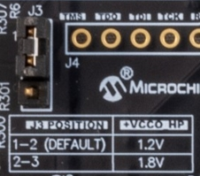
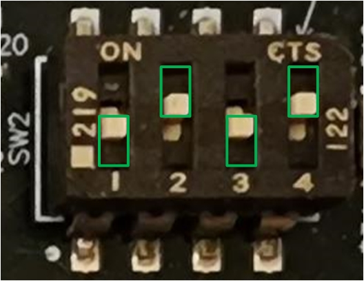
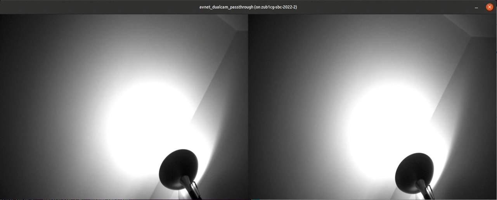
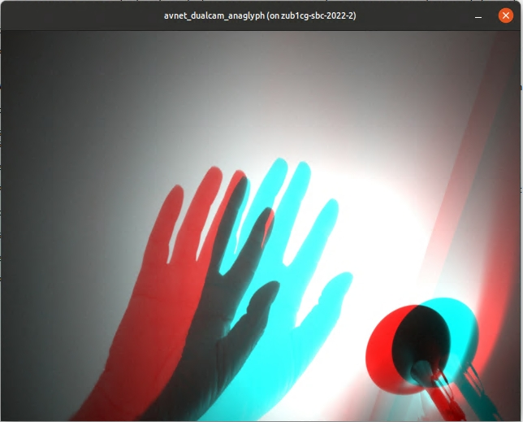

Running the PetaLinux OS Image
==============================

After the SDcard has been properly imaged, insert the card into your ZUBoard 1CG. Install the `Avnet DP-eMMC HSIO module <http://avnet.me/dpemmc>`_ on the J2 HSIO connector.  Optionally you may also wish to connect a USB keyboard.  Be sure to connect a 1080p video monitor.

.. image:: images/DPeMMC_mounted_ZUBoard.png
    :align: center

1. Set the J3 jumper on the ZUBoard to 1.2V I/O.  This is required for the MIPI interface for the cameras.

2. Set the boot mode switches (SW2) for SD card boot (1-4 off-on-off-on).

3. Press the power switch (SW7) to turn on the board.  Once the board boots you will be prompted for login credentials.
    * Login: root (no password required)

3. Open a UART console connection to the ZUBoard 1CG
    * Baud 115200
    * 8 bits
    * No parity
    * 1 stop bit

4. At the command prompt change to the **avnet_dualcam_python_examples** folder and launch the Python example.

.. code-block:: console

    $ cd ~/avnet_dualcam_python_examples
    $ python3 ./avnet_dualcam_passthrough.py

5. Press <ctrl>-c to close the demo window.  There is also a Python anaglyph application example that can be run.

.. code-block:: console

    $ python3 ./avnet_dualcam_anaglyph.py

6. Press <ctrl>-c to close the demo window.

Going Further
=============

Check out the many projects and application examples posted on Hackster.io that highlight the use of the Avnet DP-eMMC HSIO module with the ZUBoard 1CG:

* `Robot Control <http://avnet.me/vitis-ai-3.0-robot-control>`_
* `ASL Classification <http://avnet.me/vitis-ai-3.0-asl-classification>`_
* `Accelerated Edge AI <http://avnet.me/avnet-zub1cg-sbc-2022.1>`_

